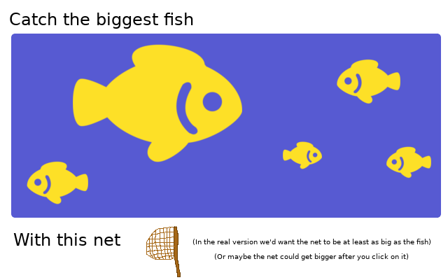

# Wetfish Captcha Requirements

This document outlines the requirements for the captcha project. The goal is to create simple interactive games that are used to verify a human is using Wetfish, preventing automated spam on the wiki and forums. Up until now reCaptcha v1 has been used on the wiki which is being discontinued at the end of March 2018. Instead of upgrading to reCaptcha v2 and training Google's AI to do image recognition, we've decided to make our own custom captcha solution.

The first captcha game will involve catching wet fish with a net, however developers are encouraged to come up with other simple captcha games and suggest them as issues in this repo.

## Wet Fish Catch


Users will be presented with a sentence explaining the challenge, a small pond filled with swimming fish of different sizes, and a net. When a user clicks on the net, the net follows their cursor around the page. When the net is covering a fish there will be an indicator that the user must continue covering the fish for a short period.

On each request a challenge will be randomly selected, and random starting positions, sizes, and patterns will be generated. Examples of possible challenges include:
 - Catch the biggest fish
 - Catch the smallest fish
 - Catch the striped fish


### Server-side initialization

The server-side should consist of a PHP class which can be included in other projects. This class would keep track of all the data related to the captcha and expose functions to initialize the captcha and check if user input is valid. When initialized, a random ID will be generated which is stored in PHP session data. Associated with this ID will be all of the data related to the captcha challenge, for example:

```php
$_SESSION[$randomID] =
[
    'challenge' => 'smallest', // Possible options: smallest, biggest, striped
    'generated_at' => '2018-04-20 3:36:44',
    'fish' =>
    [
        ['size' => 10, 'pattern' => 'none', 'x' => 20, 'y' => 40, 'direction' => 'left'],
        ['size' => 30, 'pattern' => 'striped', 'x' => 10, 'y' => 60, 'direction' => 'left'],
        ['size' => 20, 'pattern' => 'gradient', 'x' => 20, 'y' => 90, 'direction' => 'right'],
        ['size' => 40, 'pattern' => 'none', 'x' => 50, 'y' => 10, 'direction' => 'left'],
        ['size' => 20, 'pattern' => 'none', 'x' => 80, 'y' => 20, 'direction' => 'right'],
    ]
];
```

This information will never be sent to the client, instead it will be used by PHP GD to generate static images for the captcha.

Image layers:
 - Base layer, includes the challenge text and the background of the pond
 - Right fish layer, includes all fish that are swimming right
 - Left fish layer, includes all fish that are swimming left


### Client-side initialization

The client-side should consist of a prototyped JavaScript object which can be included in other projects. This object would handle sending an initialization request to the server, all user interactions, animating the captcha canvas, and sending the user's cursor position to the server.

After the page is loaded the client will send a request to the server, the server will respond with the image data required to generate the captcha. This image data will be served as three separate layers which are combined into a single canvas by the client. To conserve system resources (especially on mobile) the canvas should not be animated until the user clicks on the captcha or the net. Once the animation is started, the fish should slowly swim across the pond. As the fish swim off the edge of the pond, they should immediately wrap around to the other side.


### Solving the captcha

Once the user interacts with the captcha, the client will make a request to the server saying that the challenge started. The server will save the time that the challenge started and use that to compute the position of fish for subsequent requests. After getting a successful response from the server, the animation will start.

When the user clicks and drags on the net, it should follow their cursor around on the page (even outside of the canvas) until they release the mouse or their finger stops touching the screen on mobile. When the net is over the captcha, the client should send the mouse position to the server every 100 milliseconds. For each request the server computes the difference in the current time vs the time the challenge started and uses that to determine where the fish should currently be. If the server detects that the user is hovering over a fish, the response should indicate that an interaction is happening. After holding the mouse over the fish for a second, the server will reveal whether or not the current fish was correct.

If the captcha is solved correctly, a success message should be displayed and the captcha should be hidden. If the captcha is solved incorrectly, an error message should be displayed and the captcha should be reinitialized with new random values.


### Potential pitfalls

 - If there is significant latency between the server and client, the server may calculate that the fish are in a different position than what is displayed on the client
 - Randomly positioned fish might appear on top of each other
 - Blind users will be unable to use this captcha
 - Motor impaired users may be unable to use this captcha
